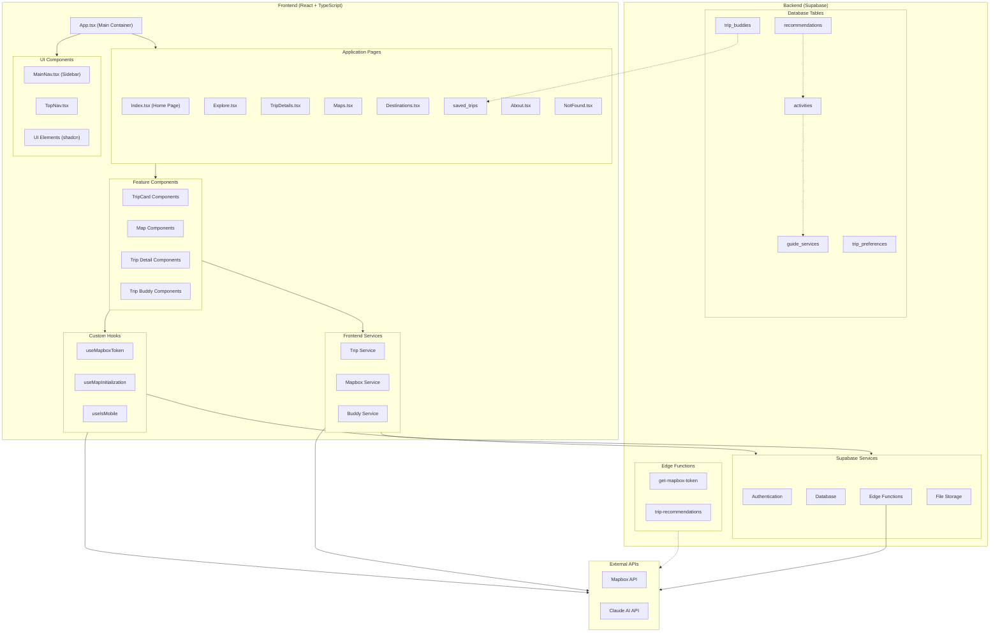

# Yugen Travel Application Architecture

This document provides an overview of Yugen's architecture, showing the relationships between frontend components, pages, backend services, and databases.

## System Architecture Diagram

## Component Descriptions

### Frontend Components

#### Pages
- **Index.tsx** - Home page with search functionality and featured trip recommendations
- **Explore.tsx** - Browse available trips with filtering options
- **TripDetails.tsx** - Detailed view of a specific trip with itinerary, map, and buddy management
- **Maps.tsx** - Interactive map exploration with navigation features
- **Destinations.tsx** - Browse destinations by region or category
- **SavedTrips.tsx** - View and manage user's saved trips
- **About.tsx** - Information about the Yugen platform

#### Core UI Components
- **MainNav.tsx** - Main navigation sidebar with links to all major sections
- **TopNav.tsx** - Top navigation bar with user controls and search
- **UI Elements** - Shadcn UI component library for consistent styling

#### Feature Components
- **TripCard Components** - Display trip summary information in a card format
  - TripCardHeader, TripCardInfo, TripCardButtons, TripCardMap
- **Map Components** - Provide interactive map functionality 
  - MapDisplay, MapContent, RouteLayer, MarkerLayer
- **Trip Detail Components** - Structured components for displaying trip details
  - TripHeader, PriceBreakdown, TripMapSection, ItineraryTab
- **Buddy Components** - Manage trip companions
  - BuddiesManager, BuddyList, InviteForm

### Services and Hooks

#### Frontend Services
- **TripService** - Handles trip data fetching, saving, and generation
- **MapboxService** - Provides map-related functionality like directions and geocoding
- **BuddyService** - Manages trip buddy invitations and status

#### Custom Hooks
- **useMapboxToken** - Securely retrieves Mapbox API token
- **useMapInitialization** - Handles map instance creation and configuration
- **useIsMobile** - Responsive design detection for mobile layouts

### Backend (Supabase)

#### Supabase Services
- **Authentication** - User authentication and session management
- **Database** - PostgreSQL database for storing application data
- **Edge Functions** - Serverless functions for secure API integrations
- **Storage** - File storage for images and documents

#### Edge Functions
- **get-mapbox-token** - Securely provides Mapbox token to frontend
- **trip-recommendations** - Generates AI-powered trip recommendations

#### Database Tables
- **saved_trips** - Stores user-saved trip information
- **trip_buddies** - Manages trip companions and their status
- **guide_services** - Information about available guides
- **activities** - Trip activities with details and requirements
- **recommendations** - Company recommendations for activities
- **trip_preferences** - User preferences for trip recommendations

### External APIs
- **Mapbox API** - Provides mapping, directions, and geocoding
- **Claude AI API** - Powers trip recommendations and personalization

## Data Flow

1. User interacts with frontend pages and components
2. Components use services to request data
3. Services communicate with Supabase database or edge functions
4. Edge functions connect to external APIs when needed
5. Data flows back to components for display
6. User actions trigger updates to database via services

## Authentication Flow

1. User signs in through Auth UI components
2. Supabase Auth service handles authentication
3. JWT token is stored in browser
4. Supabase client includes token in subsequent API requests
5. Row-Level Security (RLS) policies in database enforce access control

## Development Workflow

1. Component additions/changes in src/components
2. Page updates in src/pages
3. Service modifications in src/services
4. Database migrations via SQL commands
5. Edge function deployment through Supabase CLI
