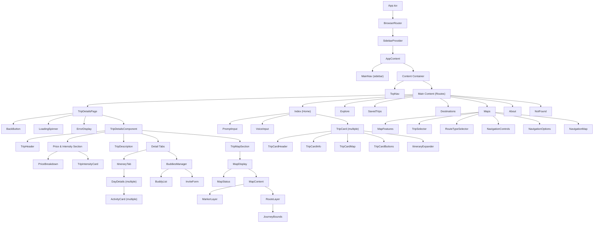

# Yugen Component Hierarchy

This document provides a detailed view of the component hierarchy in the Yugen travel application.

## Component Tree

## Key Component Relationships

### Page Components
These components represent full pages in the application and are loaded via React Router:

- **Index** - Home page with trip search and recommendations
- **TripDetailsPage** - Container for trip details with loading states
- **Explore** - Browse trips page
- **SavedTrips** - User's saved trips collection
- **Maps** - Interactive map and navigation page
- **Destinations** - Destination browsing page
- **About** - About Yugen page
- **NotFound** - 404 page

### Feature Components

#### Trip Details
- **TripHeader** - Displays trip title, location, duration, and badges
- **PriceBreakdown** - Shows trip cost with itemized expenses
- **TripIntensityCard** - Displays difficulty level with visual indicator
- **TripDescription** - Renders trip description and rationale
- **TripMapSection** - Contains interactive map for the trip
- **ItineraryTab** - Displays day-by-day trip itinerary
- **BuddiesManager** - Manages trip companions and invitations

#### Map Components
- **MapDisplay** - Container for map visualization
- **MapContent** - Manages map layers and interactions
- **MarkerLayer** - Displays points of interest on map
- **RouteLayer** - Shows routes and paths on map
- **JourneyBounds** - Sets appropriate map bounds for the journey

#### Trip Card Components
- **TripCardHeader** - Trip title and image
- **TripCardInfo** - Brief trip information
- **TripCardMap** - Small map preview
- **TripCardButtons** - Action buttons (save, share, etc.)
- **ItineraryExpander** - Expandable itinerary preview

## Component Communication

Components communicate through:

1. **Props passing** - Parent components pass data to children
2. **Context API** - Global state management (like SidebarContext)
3. **Service functions** - Data fetching and manipulation
4. **Custom hooks** - Shared functionality and state

## State Management

The application uses a combination of:

1. **React local state** - Component-specific state with useState
2. **Context API** - For shared state across components
3. **React Query** - For server state management and caching
4. **URL parameters** - For persisting view state in the URL

## Responsive Design

The application adapts to different screen sizes through:

1. **useIsMobile hook** - Detects mobile screen sizes
2. **Tailwind responsive classes** - Applies different styles based on screen width
3. **Conditional rendering** - Shows/hides components based on screen size
