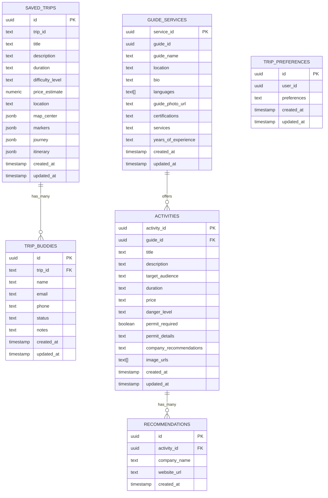

# Yugen Database Schema

This document visualizes the database schema for the Yugen travel application, showing tables, relationships, and key fields.

## Entity Relationship Diagram

## Table Descriptions

### SAVED_TRIPS
Stores information about trips that users have saved or that are generated by the AI.

- **id**: Unique identifier (UUID)
- **trip_id**: External trip identifier (used for API references)
- **title**: Trip title
- **description**: Trip description
- **duration**: Length of the trip (e.g., "5 days")
- **difficulty_level**: Trip difficulty ("Easy", "Moderate", "Challenging", etc.)
- **price_estimate**: Estimated cost of the trip
- **location**: Trip location or destination
- **map_center**: JSON object with map center coordinates (lng/lat)
- **markers**: JSON array with points of interest on the map
- **journey**: JSON object with route segments and steps
- **itinerary**: JSON array with day-by-day activities

### TRIP_BUDDIES
Manages trip companions and invitations.

- **id**: Unique identifier (UUID)
- **trip_id**: Reference to the trip
- **name**: Buddy's name
- **email**: Buddy's email address
- **phone**: Buddy's phone number
- **status**: Invitation status ("pending", "confirmed", "declined")
- **notes**: Additional notes about the buddy

### GUIDE_SERVICES
Information about guides available for trips.

- **service_id**: Unique identifier for the service (UUID)
- **guide_id**: Unique identifier for the guide
- **guide_name**: Guide's name
- **location**: Guide's primary location
- **bio**: Guide's biography
- **languages**: Array of languages the guide speaks
- **guide_photo_url**: URL to guide's photo
- **certifications**: Guide's certifications
- **services**: Services offered by the guide
- **years_of_experience**: Guide's experience level

### ACTIVITIES
Trip activities with details and requirements.

- **activity_id**: Unique identifier (UUID)
- **guide_id**: Reference to the guide offering the activity
- **title**: Activity title
- **description**: Activity description
- **target_audience**: Who the activity is designed for
- **duration**: Length of the activity
- **price**: Activity cost
- **danger_level**: Risk level of the activity
- **permit_required**: Whether permits are needed
- **permit_details**: Details about required permits
- **company_recommendations**: Recommended companies for the activity
- **image_urls**: Array of activity photos

### RECOMMENDATIONS
Company recommendations for activities.

- **id**: Unique identifier (UUID)
- **activity_id**: Reference to the associated activity
- **company_name**: Name of the recommended company
- **website_url**: Company website
- **created_at**: When the recommendation was created

### TRIP_PREFERENCES
User preferences for trip recommendations.

- **id**: Unique identifier (UUID)
- **user_id**: Reference to the user
- **preferences**: User's trip preferences
- **created_at**: When the preferences were created
- **updated_at**: When the preferences were last updated

## Data Flow Examples

### Trip Creation Flow
1. User inputs trip preferences (location, duration, activities)
2. AI generates trip recommendation
3. Trip details stored in SAVED_TRIPS table
4. Points of interest stored in the markers JSON field
5. Route information stored in the journey JSON field
6. Day-by-day activities stored in the itinerary JSON field

### Trip Buddy Invitation Flow
1. User selects a saved trip
2. User inputs buddy information (name, email, phone)
3. New record created in TRIP_BUDDIES table with status "pending"
4. Invitation sent to buddy
5. Buddy accepts/declines invitation
6. TRIP_BUDDIES record updated with new status
